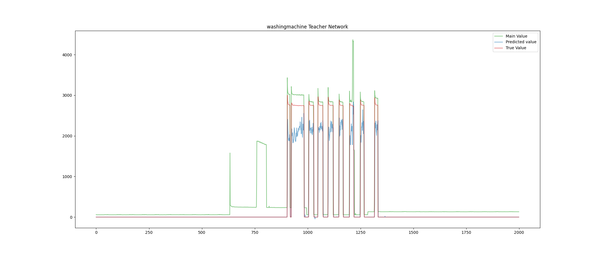
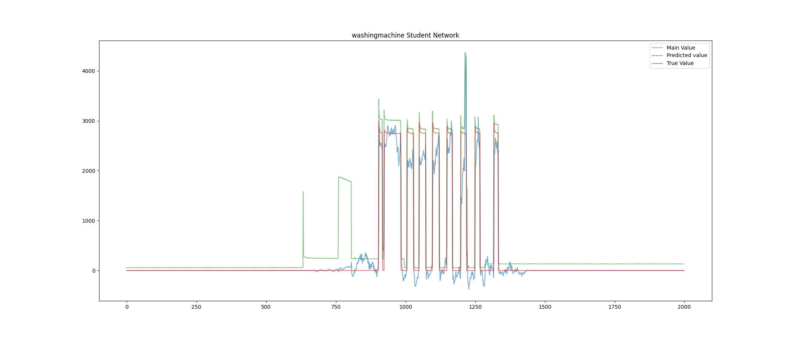

# NILM-Knowledge-Distillation

Il codice implementa una rete RNN basata su GRU per risolvere il task di Non Intrusivce Load Monitoring come rete neurale Teacher. Viene implementata una rete neurale Student addestrata attraverso Knowledge Distillation. 

loss = alpha*Lsoft +(1-alpha)*Lhard

# Use code 
il codice è composto da tre parti principali 
- dataset_manager (preparazione del dataset)
- Train_teacher (Train della teacher_network)
- Train_student (Train della student_network)

Ps. i file .sh automatizzano le operazioni di train per tutte i carichi (fridge washingmachine microwave dishwasher)

# Results
i risultati sono stati ottenuti con:
window = 200
batchsize =100
alpha = 0.8

| Appliances      |      training                    |  validation | test   |
|-----------------|:--------------------------------:|:-----------:|:------:|
| kettle          | 3, 4, 6, 7, 8, 9, 12, 13, 19, 20 |     5       |   2    |
| microwave       | 10, 12, 19                       |    17       |   4    |
| fridge          | 2, 5, 9                          |     12      |   15   |
| dish washer     | 5, 7, 9, 13, 16                  |     18      |   20   |
| washing machine | 2, 5, 7, 9, 15, 16, 17           |      18     |   8    |

 -------------------------------------------------------------------------------------------
|	          |       Fridge		  |      Microwave		|   Washingmachine	|    	Dishwasher    |
|	          |Teacher	| Student |	Teacher	| Student |	Teacher	| Student	| Teacher	| Student |
 -------------------------------------------------------------------------------------------
|Accuracy	  | 90,33%  | 91,99%	| 98,51%  | 98,24%	| 99,68%	| 98,34%	| 98,00%	| 97,89%  |
|SAE 	      | 0,2206	| 0,2210	| 0,2789  | 0,2902	| 0,1470	| 0,0400	| 0,4257	| 0,4659  |
|MAE (W)	  | 32,99	  | 31,55	  | 19,46	  | 21,57	  | 11,27	  | 18,20	  | 15,74	  | 16,94   |
|NDE	      | 0,2794	| 0,2118	| 0,6951	| 0,7459	| 0,1154	| 0,1977	| 0,3433	| 0,3538  |
 -------------------------------------------------------------------------------------------
 

